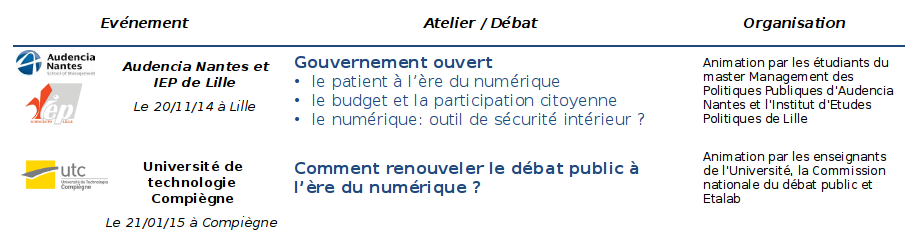
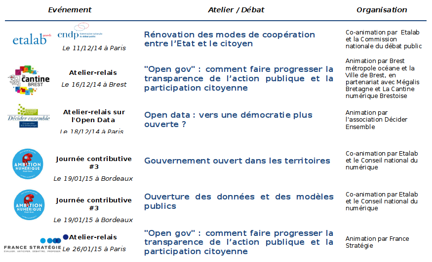

# Appendix: Methodology for NAP Development

The building and preparation of the National action plan for open government provided an
opportunity for a vast consultation with civil society, within the government and the
administration as well as with independent authorities.

Coordinated by [Etalab](https://www.etalab.gouv.fr/) within the Secretariat-General for Government Modernization, this
action plan's preparation began with the Paris conference "From open data to open
government", organized in April 2014, which brought together more than 400 participants
(representatives of governments, experts and academics, administrations and
representatives of civil society) and allowed the outlines of the French project for open
government to be sketched out.

This initial work laid the basis for the composition of the action plan, its preparation was
specified from October 2014. The ideas identified were drawn up from:

1. **An important online consultation**, carried out from October 2014 to March 2015, and
  coordinated by the French Digital Council (CNNum): This consultation collected **17,678
  contributions from more than 5,000 participants**. All of the data in this consultation, as well
  as the summaries – which were themselves submitted for comments during a period of one
  month – are available on the CNNum[^1] site.

  Within the topic dedicated to the transformation of public action, **two consultations were
  entirely devoted to "[Open Data](http://contribuez.cnnumerique.fr/debat/open-data-une-d%C3%A9mocratie-plus-ouverte-et-de-nouveaux-biens-communs)"
  and to "[Open Government](http://contribuez.cnnumerique.fr/debat/open-gov-comment-faire-progresser-la-transparence-de-l%E2%80%99action-publique-et-la-participation)"**.
  The contributions published in the other consultation subjects (notably
  "[Technological strategy of the State and public services](http://contribuez.cnnumerique.fr/debat/strat%C3%A9gie-technologique-de-letat-et-services-publics)")
  also fuelled the discussions on open government.
2. **Bilateral interviews and work sessions** with
  [some fifty associations, experts and groups of experts](https://www.etalab.gouv.fr/plan-daction-national).
  The list of organizations and personalities met was published on [Etalab's blog](https://www.etalab.gouv.fr/plan-daction-national).
3. **[Workshops and contributory events](https://www.etalab.gouv.fr/plan-daction-national), open to all** in different towns in France, by Etalab or third parties (associations, NGOs, local authorities, etc.) in the form of relay workshops.
  Networks of students were also contacted: Audencia Nantes and Lille Institute of Political Studies, Sciences Po Paris and Strasbourg, Compiègne University of technology.
  
  
4. **From the mobilization of Etalab's network of experts**: Composed of qualified personalities from civil society, from the worlds of research, business, open data or civic associations, this network is intended to inform governmental action in matters of the opening of data and of open government. Three meetings were devoted to the Action Plan
5. Proposals made in **recent reports, as well as proposals from research institutes and think tanks**: Nadal report, Lemoine report, Oural report, Bouchoux report, France Stratégie report on the public action of the future, reports from the Economic, Social and Environmental Council (CESE), as well as Work carried out by Renaissance Numérique, Terra Nova and the Montaigne Institute on "[Updated democracy]((http://www.democratiemiseajour.fr/))"...
6. Presentations, interviews and inter-services meetings with all the ministries

All of these actions enabled:
- raising awareness and communicating on open government and the preparation of the plan
- collecting new ideas, submitting proposals to civil society and working on commitments
- providing information on the progress of work and reiterating the content of the plan.

From the emergence of the first ideas, **progress report meetings open to everyone** (and accessible remotely by videoconference) were organized every month from December 2014. The media were always published on Etalab's blog.

This intense consultation enabled the identification of numerous aspirations and ideas for
improving democratic functioning.

Under the aegis of the Prime Minister the proposals concerning government action were
validated by the ministries concerned and formally accepted in an interministerial meeting.
Other commitments were contracted by independent authorities.

Above all, this work initiated a process of dialogue and contribution that should be
maintained and developed in order to ensure the implementation of this plan and prepare
subsequent versions of it.

----

[^1]: http://contribuez.cnnumerique.fr/actualite/les-6-mois-de-la-concertation-nationale-%E2%80%9Cambition-num%C3%A9rique%E2%80%9D-en-data
