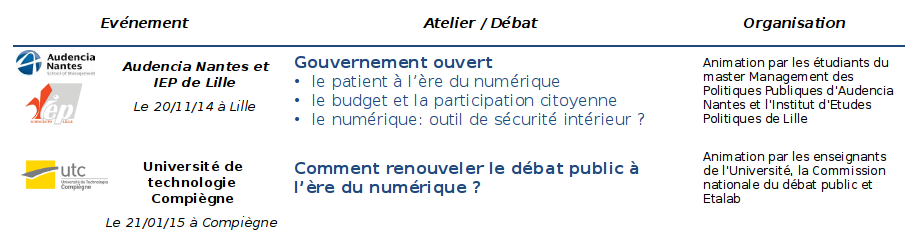
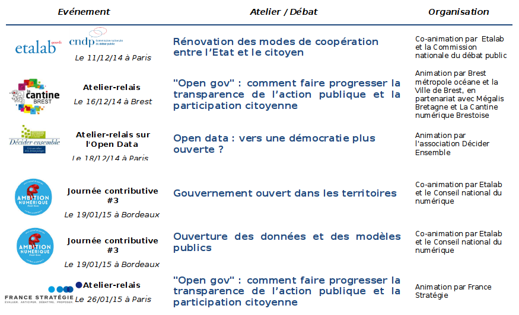

# Annexe : Méthode d'élaboration

La préparation du plan national d'action pour un gouvernement ouvert a été l'occasion d'une vaste concertation avec la société civile, au sein du gouvernement et de l'administration ainsi qu'avec les autorités indépendantes.

Coordonnée par [Etalab](https://www.etalab.gouv.fr/) au sein du secrétariat général pour la modernisation de l'action publique, l'élaboration de ce Plan d'Action a débuté dès la Conférence de Paris « De l'Open Data au gouvernement ouvert », organisée en avril 2014 qui a réuni plus de 400 participants (représentants des gouvernements, experts et universitaires, administrations, représentants de la société civile) et a permis d'esquisser les grandes lignes du projet français de « gouvernement ouvert ».

Ces premiers travaux ont nourri le cadrage du Plan d'Action, dont l'élaboration s'est précisée à partir d'octobre 2014. Les pistes identifiées ont été élaborées à partir :

1. **D'une vaste consultation en ligne**, menée d'octobre 2014 à mars 2015, et coordonnée le Conseil national du numérique (CNNum) : L'ensemble de cette  consultation a recueilli **17 678 contributions par plus de 5000 participants**. L'ensemble des données de cette consultation, ainsi que les synthèses – qui ont elles-mêmes été soumises à commentaires durant un mois – sont disponibles sur le site du CNNum[^1].

  Au sein du thème dédié à la transformation de l'action publique, **deux consultations ont été consacrées entièrement à l'« [Open Data](http://contribuez.cnnumerique.fr/debat/open-data-une-d%C3%A9mocratie-plus-ouverte-et-de-nouveaux-biens-communs) » et au « [Gouvernement Ouvert](http://contribuez.cnnumerique.fr/debat/open-gov-comment-faire-progresser-la-transparence-de-l%E2%80%99action-publique-et-la-participation) »**. Les contributions publiées dans d'autres sujets de consultation (notamment « [Stratégie technologique de l'Etat et services publics](http://contribuez.cnnumerique.fr/debat/strat%C3%A9gie-technologique-de-letat-et-services-publics) ») ont également nourri la réflexion sur le gouvernement ouvert.
2. **D'entretiens bilatéraux et de sessions de travail** avec une [cinquantaine d'associations, experts ou groupes d'experts](https://www.etalab.gouv.fr/plan-daction-national).  La liste des organisations et personnalités rencontrées a été publiée sur le [blog d'Etalab](https://www.etalab.gouv.fr/plan-daction-national).
3. **D'[ateliers et d'évènements contributifs](https://www.etalab.gouv.fr/plan-daction-national), ouverts** à tous dans différentes villes de France, par Etalab ou par des tiers (associations, ONG, collectivités…) sous forme d'ateliers-relais. Les réseaux étudiants ont également été sollicités : Audencia Nantes et Institut d'Etudes Politiques de Lille, Sciences Po Paris et Strasbourg, Université de technologie de Compiègne.
  
  
4. **De la mobilisation du réseau d'experts d'Etalab** : Composé de personnalités qualifiées de la société civile, issues du monde de la recherche, de l'entreprise, de l'open data ou des associations citoyennes, ce réseau a vocation à éclairer l'action gouvernementale en matière d'ouverture des données et de gouvernement ouvert. Trois réunions ont été consacrées au Plan d'Action.
5. Des propositions formulées dans des **rapports récents, ainsi que des propositions d'instituts de recherche et think tanks** : rapport Bouchoux, rapport Lemoine, rapport Oural, rapport Nadal, rapport France Stratégie sur l'Action publique de demain, rapports du CESE…, travaux menés par Renaissance numérique, Terra Nova et l'Institut Montaigne sur la « [Démocratie mise à jour](http://www.democratiemiseajour.fr/) »…
6. De **présentations, entretiens et réunions avec les ministères et acteurs publics concernés**

Toutes ces interactions ont permis :
- de sensibiliser et de communiquer sur le gouvernement ouvert et l'élaboration du Plan ;
- de collecter de nouvelles pistes, de soumettre les propositions à la société civile et de travailler les engagements ;
- d'informer sur l'avancée des travaux, et d'itérer sur le contenu du Plan.

Dès l'émergence de premières pistes, **des restitutions « points d'étape » ouvertes à tous** (et accessibles à distance en visioconférence), ont été organisées tous les mois à partir de décembre 2014. Les supports ont systématiquement été publiés sur le [blog d'Etalab](https://www.etalab.gouv.fr/plan-daction-national).

Cette concertation a permis d'identifier de nombreuses aspirations et de nombreuses pistes d'amélioration du fonctionnement démocratique.

Sous l'égide du Premier ministre, les propositions qui concernaient l'action du gouvernement ont été validées par les ministères concernés et formellement acceptées en réunion interministérielle. D'autres engagements ont été contractés par les autorités indépendantes.

Ces travaux ont surtout permis d'amorcer une dynamique de dialogue et de contribution qu'il faudra maintenir et développer afin d'assurer la mise en œuvre de ce Plan d'action et en préparer les versions ultérieures.

----

[^1]: http://contribuez.cnnumerique.fr/actualite/les-6-mois-de-la-concertation-nationale-%E2%80%9Cambition-num%C3%A9rique%E2%80%9D-en-data
